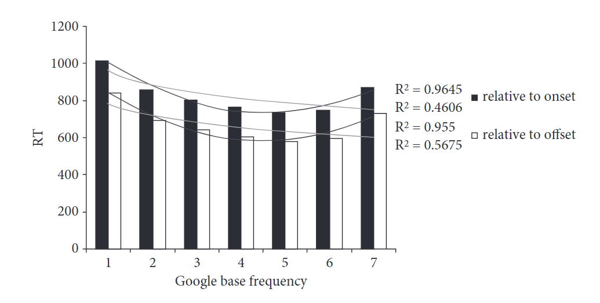

```{r setup, include = FALSE}
library("papaja")
library(tidyverse)
library(brms)
library(mgcv)
library(mgcViz)
library(rgl)
#library(visibly)
library(schoenberg) 
library(ggpubr)
library(mdthemes)
library(broom)
library(tidybayes)
library(ggdist)
library(rlist)
library(showtext)
library(gt)
library(scales)
library(ggpubr)
library(flextable)
library(officer)
library(gtsummary)
library(xtable)
library(ggrepel)

#r_refs("r-references.bib")
#my_citations = cite_r(file = "r-references.bib")
```

```{r Models, echo = F, message = F, warning = F}

#gam models
mod_gam1 = readRDS('../Models/mod_gam1.rds')
mod_gam_phrasal_nonphrasal = readRDS('../Models/mod_gam_phrasal_nonphrasal.rds')
mod_bam_inter = readRDS('../Models/mod_bam_inter.rds')

#brms models
options(contrasts = c("contr.sum","contr.sum"))
priors = c(prior(student_t(3, 0, 2.5), class = 'sd'),     #pretty standard sd and sigma priors
           prior(student_t(3, 0, 2.5), class = 'sigma'), 
           #prior(lkj(1), class = 'cor'), 
           prior(student_t(3, 0, 2.5), class = 'Intercept'),  #slightly negative intercept
           prior(normal(0, 0.1), class = 'b')) #slightly negative prior for beta coefficients
brms_quadratic_no_interaction = brm(log_rt ~ log_freq + log_predic + Duration + #fixed-effects
                        I(log_predic^2) + I(log_freq^2) + #quadratic component
                       (1 + log_freq + log_predic + Duration + I(log_predic^2) + I(log_freq^2) || participant) + (1||Item), #random effects
                     data = gam_data,
                     warmup = 10000,
                     iter = 20000,
                     cores = 8,
                     chains = 8,
                     init = 0,
                     control = list(adapt_delta = 0.99),
                     prior = priors,
                     file = '../Models/brms_quadratic_english_no_interaction') 

options(contrasts = c("contr.sum","contr.sum"))
priors = c(prior(student_t(3, 0, 2.5), class = 'sd'),     #pretty standard sd and sigma priors
           prior(student_t(3, 0, 2.5), class = 'sigma'), 
           #prior(lkj(1), class = 'cor'), 
           prior(student_t(3, 0, 2.5), class = 'Intercept'),  #slightly negative intercept
           prior(normal(0, 0.1), class = 'b')) #slightly negative prior for beta coefficients
brms_freq_quadratic_no_interaction = brm(log_rt ~ log_freq + Duration + #fixed-effects
                       I(log_freq^2) + #quadratic component
                       (1 + log_freq + Duration + I(log_freq^2) || participant) + (1||Item), #random effects
                     data = gam_data,
                     warmup = 5000,
                     iter = 10000,
                     cores = 8,
                     chains = 8,
                     init = 0,
                     control = list(adapt_delta = 0.99),
                     prior = priors,
                     file = '../Models/brms_freq_quadratic_english_no_interaction') 

options(contrasts = c("contr.sum","contr.sum"))
priors = c(prior(student_t(3, 0, 2.5), class = 'sd'),     #pretty standard sd and sigma priors
           prior(student_t(3, 0, 2.5), class = 'sigma'), 
           #prior(lkj(1), class = 'cor'), 
           prior(student_t(3, 0, 2.5), class = 'Intercept'),  #slightly negative intercept
           prior(normal(0, 0.1), class = 'b')) #slightly negative prior for beta coefficients
brms_predic_quadratic_no_interaction = brm(log_rt ~  log_predic + Duration + #fixed-effects
                        I(log_predic^2) + #quadratic component
                       (1 + log_predic + Duration + I(log_predic^2) || participant) + (1||Item), #random effects
                     data = gam_data,
                     warmup = 5000,
                     iter = 10000,
                     cores = 8,
                     chains = 8,
                     init = 0,
                     control = list(adapt_delta = 0.99),
                     prior = priors,
                     file = '../Models/brms_predic_quadratic_english_no_interaction') 

brms_plot = readRDS('Figures/brms_plot.rds')

freq_plot_full_quadratic = plot(brms_plot, plot = F)[[1]] +
  theme_bw()

predic_plot_full_quadratic = plot(brms_plot, plot = F)[[2]] +
  theme_bw()

freq_plot_full_quadratic = freq_plot_full_quadratic +
  ylab('Log Reaction Time') +
  xlab('Log Frequency') +
  theme_bw() +
  theme(axis.text=element_text(size = 12),
        axis.title=element_text(size  = 14)) 
predic_plot_full_quadratic  = predic_plot_full_quadratic +
  ylab('Log Reaction Time') +
  xlab('Log Predictability') +
  theme_bw() +
  theme(axis.text=element_text(size = 12),
        axis.title=element_text(size  = 14))

brms_freq_plot_freq_quadratic = readRDS('Figures/brms_freq_plot.rds')

freq_plot_freq_quadratic = plot(brms_freq_plot_freq_quadratic, plot = F)[[1]] +
  ylab('Log Reaction Time') +
  xlab('Log Frequency') +
  theme_bw() +
  theme(axis.text=element_text(size = 12),
        axis.title=element_text(size  = 14)) 

brms_predic_quadratic_plot = readRDS('Figures/brms_predic_plot.rds')
brms_predic_quadratic_plot = plot(brms_predic_quadratic_plot, plot = F)[[1]] +
  ylab('Log Reaction Time') +
  xlab('Log Predictability') +
  theme_bw() +
  theme(axis.text=element_text(size = 12),
        axis.title=element_text(size  = 14)) 

data_verbs_up = read_csv('../Data/Stimuli - Phrasal verbs.csv') %>%
  mutate('Frequency (per Million)' = Frequency / 6.45295E+11 * 1000000) %>%# convert raw frequency to frequency per million
#data_words_containing_up = read_csv()
  mutate(Lemma = paste(Verb, Up, sep = ' '))
```

# Introduction

When a listener hears the phrase *trick or treat*, do they process it compositionally, processing each word individually before combining them into a single parse? Or do they access a single holistically stored representation of the phrase from memory? This question of to what extent larger-than-word constructions can be stored and accessed holistically is one that psycholinguists have been interested in for quite some time [e.g., @bybee2002; @bybee2003; @goldberg2003; @nooteboom2002; @stemberger1986; @stemberger2004].

Throughout the years different theories have argued for different degrees of holistic storage, with two theories in particular dominating the field. On one hand, Chomskyan theories [e.g., @chomskyAspectsTheorySyntax1965] have proposed that only necessary items (e.g., items that can't be formed compositionally) are stored. On the other hand, usage-based theories [e.g., @bybee2003] have proposed that some items that could in principle be formed compositionally can be stored under certain usage-based conditions, such as frequency of use.

Traditional Chomskyan theories [e.g., @chomskyAspectsTheorySyntax1965] have argued that processing multi-word phrases is completely compositional: each piece is accessed individually and then combined to form the larger meaning. Some exceptions are reserved for idioms and other outliers, which can't be formed compositionally. More specifically, Chomskyan views of storage argue that whether an item is stored is determined purely by the degree of compositionality. According to these theories, if a multi-word expression can be composed from its parts then there is no need to holistically store the expression, and thus it is not stored holistically. For example since *I don't know* can be processed compositionally, it would be processed by composing a representation from each of the individual words, *I, don't,* and *know*. On the other hand, *kicked the bucket* would be stored holistically because there's very little relationship between the meaning of the individual words and the meaning of the expression (i.e., it's non-compositional).

Chomskyan theories of storage gained popularity partly because storage was thought to be a valuable resource that was taken up only by units that necessitated storage. This was perhaps influenced by the limited storage space of sophisticated computers at the time. In recent times, however, we've learned that the brain may have dramatically more space for storage than we had previously realized, with an upper bound of 10^8432^ bits [@wang2003]. This is magnitudes larger than any current estimate of how much storage language requires.[^1] Considering this, it might not come as a surprise that there has been a rise in support for usage-based theories of holistic storage over the past few decades [@kapatsinski2009; @kapatsinski2018; @stemberger1986; @stemberger2004; @morgan2016; @bybee1999; @bybee2001; @bybee2002; @bybee2003; @baayenDutchInflectionRules2002; @ambridgeStoredAbstractionsRadical2020; @zangParafovealProcessingChinese2024].

[^1]: Indeed, @mollica2019 estimated that, in terms of linguistic information, humans store only somewhere between one million and ten million bits of information, meaning that even their upper estimate is well within the capacity of the brain.

Usage-based theories posit that more than just non-compositional items (e.g., multi-word expressions) may be stored holistically in the lexicon, arguing that storage is driven by usage-based factors. For example, factors like frequency or predictability of the phrase may influence whether the phrase is stored holistically or not. According to these theories, in addition to idioms and non-compositional items, multi-word phrases such as *I don't know* may also be stored holistically if they are used frequently enough [e.g., @ambridgeStoredAbstractionsRadical2020; @kapatsinski2018; @kapatsinski2009; @hay2001; @lee2015; @arnon2010; @stemberger1986; @stemberger2004; @morgan2016; @tomasello2005].

While it has become a dominant view in the field that at least some multi-word items are stored, it remains unclear what exactly the size of the units being stored is and, more so, what the factors driving storage are. Further, if multi-word representations are stored holistically, what are the consequences of this in terms of language processing?

## Evidence of Holistic Storage

There is no shortage of evidence for holistic multi-word storage [e.g., @bybee1999; @stemberger1986; @stemberger2004; @hay2001; @christiansen2017; @zwitserlood2018], especially in the phonology literature. For example, @bybee1999 demonstrated that the word *don't* is reduced to a larger extent in the phrase *I don't know* than in other phrases containing *don't*. In other words, the phrase *I don't know* seems to have its own mental representation. If it was the case that the representation of *don't* in *I don't know* was the same as the representation of *don't* in other contexts, then one would expect *don't* to be equally reduced in both cases [which is contrary to the finding in @bybee1999]. Similarly, in Korean, certain consonants undergo tensification when they occur after the future marker -*l*. The rate of this tensification is higher in high-frequency phrases than low-frequency phrases, further suggesting that high-frequency phrases may be stored holistically [@yi2002].

In addition to the phonology literature, the Psycholinguistics literature has also provided an abundance of evidence for multi-word storage. For example, @siyanova-chanturia2011 demonstrated that binomial phrases (e.g., *cat and dog*) are read faster in their more frequent ordering than in their less frequent ordering. Further, in a follow-up study, @morgan2016 demonstrated that these ordering preferences for frequent binomials are not due to abstract ordering preferences (e.g., a preference for short words before long words), but are rather driven by experience with the specific binomial (i.e., how frequent each binomial ordering is), providing additional evidence that frequent phrases are stored holistically.

Further, there is also evidence of multi-word storage from the learning literature. For example, @siegelman2015 demonstrated that learning is facilitated by attending to the whole utterance, as opposed to attending to each individual word. Specifically, they used an artificial language paradigm to examine adult L2 learners' ability to learn grammatical gender. They found that adults learn grammatical gender better when they are presented with unsegmented utterances rather than segmented utterances. In other words, attending to the entire utterance, rather than learning to compose the utterance word-by-word, facilitated their learning. It seems plausible that the learned segments are the segments being stored, and that storing larger-than-word chunks is possibly what is facilitating the learning of grammatical gender in their study.

<!--# is there a follow-up study we could do looking at whether holistic storage facilitates learning? -->

## What Drives Storage?

Despite the evidence of multi-word holistic storage, however, it is still largely unclear what factors drive storage. Humans seem to be sensitive to a variety of statistical information, including both frequency [e.g., @bybee1999; @maye2000; @kapatsinski2009; @lee2015] and predictability [e.g, @olejarczuk2018; @ramscar2013].

Traditionally, frequency has been assumed to be the driving factor behind multi-word storage. Indeed, most of the examples of storage given so far have been with respect to frequency. Perhaps the most famous series of studies demonstrating this were conducted by Bybee [@bybee1999; @bybee2003; @bybee2001]. In a series of studies, Bybee and colleagues demonstrated that a variety of words are reduced more in high-frequency contexts than low-frequency contexts [additionally see @kapatsinskiHierarchicalInferenceSound2021 for further discussion of this]. For example, in addition to the earlier examples, *going to* can be reduced in the frequent future marker, *gonna*, but not in the less frequent verb phrase construction describing motion [e.g., \**gonna the store*, @bybee2003]. This mirrors patterns we see on a word-level (which for the most part must be stored). For example, the reduction of vowels to schwa in English is more advanced in high-frequency words than low-frequency words [@hooper1976; @bybee2003]. In other words, the fact that sound changes occur differently depending on the frequency of the word/phrase in a context suggests that they have separate representations (i.e., holistic storage).

On the other hand, predictability has not been directly examined much within the context of holistic multi-word storage. As far as the authors are aware, there is only one study directly examining the role of predictability in multi-word storage [@houghton2023does]. In their study, using the maze task[^2] [@boyceMazeMadeEasy2020] the authors examined whether participants were slower to select the first noun in high-predictability compound nouns in locally implausible contexts (i.e., contexts where the first noun in the compound is implausible but where the second noun eliminates the implausibility; see the below sentences) relative to low-predictability compound nouns.

[^2]: In the maze task, participants are presented a sentence word-by-word. For each word in the sentence, they are presented with the target word and an ungrammatical distractor. Upon selecting the target word, the next word in the sentence is presented along with yet another ungrammatical distractor. The key measure is how long it takes for participants to select the target word.

1.  

    **High Predictability Plausible:**

    :           Jimmy spread out the peanut butter.

2.  

    **High Predictability Implausible:**

    :       Jimmy picked up the peanut butter.

\noindent Note that in the implausible condition, the second noun always eliminates the implausibility (i.e., *spread out the peanut* is implausible, but *spread out the peanut butter* is not). If high-predictability compound nouns are stored holistically, participants may be able to access the full compound noun upon encountering the first noun, thus overcoming the local implausibility effect (since the second noun in the compound always eliminates the implausibility). Interestingly, they found that the first noun in the compound nouns was selected equally slower for both high and low-predictability compound nouns (relative to their plausible counterparts). That is, there was an increase in reaction time for selecting the first noun in the compound in the implausible condition (relative to the plausible condition) regardless of the predictability of the second noun in the compound noun. Their results suggest that either predictability doesn't drive the holistic storage of compound nouns or that it doesn't facilitate processing in this manner. However they noted that this may be a task effect, since they used the maze task as opposed to an eye-tracking task.

Despite the lack of direct evidence of predictability in the role of multi-word storage, however, predictability has been shown to play a crucial role in learning [@olejarczuk2018; @ramscar2013; @saffran1996]. For example, @olejarczuk2018 demonstrated that when learning new phonetic categories, learners don't just pay attention to co-occurrence rates, but actively try to predict upcoming sounds, suggesting that the learning of phonetic categories is also driven by prediction (i.e., the predictability of a given sound within a context). Further, in learning new words, @ramscar2013 demonstrated that children are sensitive to how predictable a cue is of an outcome (e.g., a high-frequency cue will be ignored if it isn't predictive of a specific outcome). Additionally, word-segmentation (i.e., learning which segments in an utterance are words) is also highly sensitive to predictability [@saffran1996]. In their classic paper, @saffran1996 demonstrated that children keep track of transitional probabilities -- a measurement of predictability -- to segment the speech stream. While these are studies examining learning, not storage, the units that we learn may likely be the units we store. If predictability drives what we learn, it may also drive what we store.

Thus, the current literature presents strong evidence for the role of frequency in the storage of multi-word phrases, as well as suggests the possibility of a further influence of predictability. However, it remains unclear to what extent each of these factors drives storage and whether they interact at all with each other.

## Processing Consequences of Storage

Given the evidence that a lot more may be stored than previously thought, another important question to consider is what exactly the processing consequences of storage are. Specifically, do the stored units maintain their own internal representation with respect to their component parts? For example, it is possible that the representation of high-frequency phrases, such as *pick up,* retains the representations of the component parts *pick* and *up*. On the other hand, it is possible that the phrase lacks internal representation of the component parts, either because it was lost over time or because it was never learned -- we will revisit both of these ideas in the discussion section.

<!--# it's unclear what it means for a phrase to "lose some amount of its internal representation with respect to its component parts" I think. Maybe include something like: This loss can take the form of a loss of semantic representation (e.g., losing the connection to the meaning of the component phrases, or phonological representation (losing the internal representation of the component phonological parts), or a combination of these (or more?) -->

Indeed, there seems to be some evidence that multi-word phrases may not have a fully intact internal structure with respect to their component parts. For example, @kapatsinski2009 demonstrated that in high frequency V+*up* constructions, it is harder to recognize the segment *up* (with respect to medium-frequency V+*up* constructions). This suggests that those items may have a holistic representation that has lost some of its internal structure. In their study, participants were given different auditory sentences and tasked with pressing a button immediately if they heard the segment *up*. Interestingly, they found that recognizability of *up* follows a U-shaped pattern with respect to the frequency of the phrase. That is, participants were slow to recognize *up* in low frequency phrasal verbs, but for medium-high frequency phrasal verbs they were quicker to recognize *up*. However, upon reaching the highest frequency words participants grew slower to recognize *up* (See Figure \@ref(fig:kapatsinskiplot)). Though it's important to note that the original paper does not take into account predictability. It's unclear how to account for the increase in recognition time for the highest frequency items if there is no loss of internal representation of those items.

A visualization of what a stored representation with and without internal structure may look like is presented in Figure \@ref(fig:lossInternal). The left tree represents the phrase *pick up* stored with its internal structure still intact, whereas the right tree represents *pick up* stored without internal structure. Note that both trees are examples of a holistically stored representation. The key difference is whether the internal structure remains intact in the holistic representation. The results from @kapatsinski2009 suggest that for high-frequency verb+*up* collocations, their representation may be more similar to the tree on the right, since participants were slower to recognize *up*. We will revisit this point in the discussion section in more detail.

<!--# Food for thought:  Indeed, the presence of holistic representations brings with it some important questions. For example, upon hearing pick up, does accessing the holistic representation arise from accessing the individual words? Or is it possible to access the holistic representation without even accessing the individual words that comprise it? Further, what happens to the compositional representation (either holistically stored with internal structure or composed from the individual words) when we access the holistically stored representation. For example, do we somehow inhibit the compositional representation when we access the holistically stored representation? If not, then why is it that subjects in @kapatsinski2009frequency were slower to respond to the highest frequency items?-->

(ref:kapatsinskicap) The U-shaped effect of the frequency of verb+*up* constructions on the speed with which up is detected, reproduced from @kapatsinski2009.

```{r kapatsinskiplot, echo = F, out.width = '70%', fig.align = 'center', warning = F, message = F, fig.cap='(ref:kapatsinskicap)'}


```

(ref:lossInternalcap) A diagram of two ways the word *pick up* could be stored. The left tree demonstrates a stored representation of *pick up*, where the internal structure is still intact. The right tree demonstrates a holistically stored unit, where there is a loss of internal structure. Note that these are stored structures, as opposed to a compositional representation of *pick up* which would be comprised of the individual representations *pick* and *up*.

```{r lossInternal, echo = F, out.width = '30%', fig.align = 'center', warning = F, message = F, fig.cap='(ref:lossInternalcap)'}

knitr::include_graphics('Figures/syntax_tree.png')
```

It's worth noting that in the case of phrasal verbs like *pick up*, it can't be the case that the entire internal representation is lost because it is possible to syntactically alternate it (e.g., *pick up the cup* vs *pick the cup up*). However, it is possible that semantic or lemma information is lost in the holistic representation. In other words, loss of internal representation may happen at different levels as opposed to being an all-or-nothing process.

Additionally, there is also evidence from the word-recognition literature that some stored words may also lose some of their internal structure as well. For example, @healy1976 examined participants' ability to recognize letters in various words. He found that people were worse at recognizing the letter *t* in *the* than in other lower frequency words, which suggests that even words can develop a representation separate from their component pieces (in this case, the component parts being letters instead of words). If it is the case that *the* is recognized as a composition of its parts, then it's unclear how to account for these results [c.f., @kapatsinski2009, who suggested that one explanation is that people don't fixate as long on high-frequency and function words, of which *the* is both].

On the other hand, there is a necessary temporal linearity to speech, so listeners receive the information for some of the component parts before the entire phrase. For example, the listener necessarily hears *pick* before *pick up*. It seems unlikely that a listener would process *pick up* without having processed *pick* at all. Thus if holistically stored phrases do lose the representation of their component parts, it's unclear what exactly the relationship with processing is. One such possibility that was put forth by both @kapatsinski2009 and @healy1976 is that during processing, the holistic representations compete with the representations of the individual parts for recognition. In other words: for high frequency phrases, hearing *pick* may be enough to predict that the speaker intends to say *pick up*. The listener may then process *pick up* before actually hearing *up* (thus explaining the increase in recognition times for *up* in the highest frequency items). In other words, once the listener finishes processing the phrase, they move on to the rest of the utterance, even if they haven't fully processed the individual parts.[^3] This is necessary to account for the results in @kapatsinski2009 because high-frequency phrases are still processed more quickly than lower frequency phrases. If accessing the holistic representation facilitates the accessing of the individual parts [as predicted by the IA model, @mcclellandInteractiveActivationModel1981], then we would expect to see a decrease in recognition times for the component parts. However, an increase in recognition times suggests there is competition for recognition between the holistic representation and the representations of the individual parts.

[^3]: Note that competition can be implemented in other ways though, e.g., using top-down inhibition [@libbenEverythingPsycholinguisticsMaterial2005].

<!--# one follow-up idea would be to do an eye-tracking experiment to look at the fixation if up in the same items (in a reading study). Presumably they skip up in frequent contexts? This seems like an obvious finding so maybe not worth checking. Not sure it tells us anything new. -->

## Present Study

The present study examines the factors that drive storage and the processing consequences of storage by extending @kapatsinski2009 to look at the effects of both frequency, predictability, and their interaction on the processing of V+*up* phrases. Similar to @kapatsinski2009, participants are tasked with pressing a button once they hear the segment *up* (which in our study occurs either as a particle within verb phrases, e.g., *pick up*, or part of a word, e.g., *puppet*), but in our case the stimuli varied in both frequency and predictability. Since frequency effects are rather robust in the literature, we should at the very least see a negative correlation between frequency and recognition time (up to perhaps a certain point, where recognition time may increase). The effects of predictability on recognition times, however, are still relatively untested in the literature. If predictability is not a driving factor of storage, we should see only frequency effects on the recognizability of *up*. On the other hand, if predictability does drive storage, we may see a loss of internal representation for high-predictability items. Further, if storage does result in a loss of internal structure, we should see similar effects to those found in @kapatsinski2009. Specifically, we should see a U-shaped effect, where recognition gets easier until we get to the highest frequency/predictability items, where recognizability should then become harder.

<!--# this part needs to be revised (the above part) -->

# Methods

## Participants

Participants were recruited through the University of California, Davis Linguistics/Psychology Human Subjects Pool. 350 people participated in this study and were compensated in the form of SONA credit. All participants self-reported being native English speakers. Additionally, 44 participants were excluded due to an accuracy score below our threshold of 70%, leaving a total of 306 participants for the data analysis.

## Materials

We searched the Google *n*-grams corpus [@linSyntacticAnnotationsGoogle2012] for the most predictable and the highest frequency phrases that matched our criteria of containing a verb immediately followed by the word *up*. We operationalized predictability as the odds ratio of the probability of *up* occurring immediately after the verb to the probability of any other word occurring (Equation \@ref(eq:logOdds)):

\begin{equation}
(\#eq:logOdds)
\frac{\mathrm{count(\textit{Verb+up})}}{\mathrm{count(\textit{Verb})} - \mathrm{count(\textit{Verb+up})}} 
\end{equation}

In non-mathematical terms, the above equation quantifies how likely *up* is to follow after the verb relative to every other word that could follow. For example, the odds ratio of *pick up* would be the number of times the entire verb phrase occurs -- *pick up* -- divided by the number of times the verb -- *pick* -- occurs without *up* following it.

For the purposes of the present study, we gathered a variety of phrases that varied in both their predictability and frequency and their combination. In order to do this, we extracted the 50 most frequent Verb+*up* items and the 50 most predictable ones. Next, we selected 100 more by randomly sampling from the remaining items. In order to ensure stable predictability estimates we eliminated words that a college-aged speaker wouldn't have heard more than 10 times.[^4] We then visually inspected the data to confirm that our data spanned across both the frequency and predictability continuum. This distribution is presented in Figure \@ref(fig:stimplot2) below.

[^4]: @levyProcessingExtraposedStructures2012 extrapolated that the average college-aged speaker has heard about 350 million words in their lifetime. Thus we excluded items that had a frequency smaller than 10 per 350 million.

```{r stimplot2, echo = F, out.width = '80%', fig.align = 'center', warning = F, message = F, fig.cap = "log-predictability by log-frequency (per million) plot of our items."}
data_verbs_up = data_verbs_up %>%
  filter(Verb != 'press')
plot1 = ggplot(filter(data_verbs_up), aes(y = log(`Frequency (per Million)`), x = log(Predictability))) +
  geom_point() +
  geom_text_repel(size = 2.5, aes(x = log(Predictability), y = log(`Frequency (per Million)`), label = Lemma), hjust='inward', vjust='inward', data=subset(data_verbs_up, `Frequency (per Million)` > 12 | Predictability > 4 | log(Predictability) < -8)) +
  ylab(bquote(log[e](Frequency))) +
  xlab(bquote(log[e](Predictability))) +
  theme_bw()

plot1
```

Some verb phrases containing *up* display unique syntactic patterns. For example, see the below verb phrases:

\begin{exe} 
\ex
  \begin{xlist}
    \ex The controversy stirred up a heated debate. \\
    \ex ??The controversy stirred a heated debate up. \\
  \end{xlist}
\end{exe}

These verbs show a syntactic alternation that is not present in all verb+*up* collocations (e.g., *stirred up a heated debate* is fine, but *stirred a heated debate up* is weird at best). It is possible that due to this syntactic alternation, phrasal verbs may be stored regardless of frequency/predictability. Thus, we additionally coded our stimuli for whether they were phrasal verbs or not. This coding was done based on whether they could syntactically alternate between having the noun within the verb phrase and having the noun immediately after the verb phrase. For example, since both *pick the cat up* and *pick up the cat* are grammatical, *pick up* was classified as a phrasal verb. Each item was checked by two of the authors. Disagreement was easily resolved by discussion and an agreement was reached for every item.

We also searched the same corpus for words that contained the segment *up* (e.g., *cupcake*). In order to gather a subset of words that roughly matches the frequency range of our experimental stimuli, we extracted the 50 most frequent words, then sampled from the rest of the dataset to gather an additional 100 words. These 350 items together comprise our stimuli.

For each item, we constructed two sentences: one sentence which contained *up*, and one sentence that was identical except that it didn't include the segment *up.* For words, the entire word was replaced. For phrases, *up* was simply deleted if possible (e.g., *clean up* replaced with *clean*). If this resulted in an awkward sentence, the entire phrase was replaced. An example is given below.

\begin{exe} 
\ex
  \begin{xlist}
    \ex He picked up the phone and answered the call. \\
    \ex He grabbed the phone and answered the call. \\
  \end{xlist}
\end{exe}

In summary, our stimuli were comprised of 200 Verb+*up* phrases that varied in both frequency and predictability, 150 words that contained *up*, and 350 filler sentences which were matched with our experimental sentences with the exception of having *up* replaced.

After creating the sentences, a native English speaker then recorded each sentence in a random order to minimize any list effect. We subsequently equalized the amplitude such that every sentence was roughly the same loudness.

## Procedure

Participants were presented with audio sentences via Pavlovia (<https://pavlovia.org/>), a website for presenting PsychoPy experiments [@peircePsychoPy2ExperimentsBehavior2019]. Each participant was presented with 3 practice trials and then 350 sentences. While we had a total of 700 sentences, participants didn't see both the filler and experimental sentence for the same item, thus they only saw half of the stimuli. The order of the sentences was random and exactly half of the sentences contained the target segment (to avoid biasing the participants towards a specific response). Participants were instructed to press a key as soon as they heard the segment *up*, or to press a separate key at the end of the sentence if they did not hear the target segment in the sentence. We then recorded their reaction time of the button press. The experiment took approximately 40 minutes.

## Analysis

The data[^5] was analyzed using General Additive Mixed models, as implemented in the *mgcv* package [@mgcv] within the R programming environment [@Rpackage]. General Additive Mixed Models are models that allow us to model our outcome variable as a combination of the predictors. GAMMs differ from generalized linear regression models in that they allow the predictors to be modeled as non-linear functions, similar to polynomial regression. Specifically, in a Generalized Additive Mixed Model, beta-coefficients are replaced with a smooth function, which is a combination of splines. The more splines that we include, the more wiggly our line will be. In order to avoid overfitting, GAMMs also include a penalty term, $\lambda$, which can be modified to penalize more wiggly lines that aren't justified by the data. While the predictors are allowed to vary non-linearly, the linking function in our case was linear (i.e., response time varied linearly with the spline functions).

[^5]: The stimuli, data, and analyses scripts can all be found freely available here: <https://github.com/znhoughton/Recognizability-Experiment>

For all of our models, the dependent variable was the time it took for participants to react to the onset of the target segment (i.e., the time it took participants to press the button after hearing *up*). For the first model, the predictors were the interaction between log-predictability and log-frequency, which was allowed to vary non-linearly, and duration of the segment, which was not allowed to vary non-linearly. Additionally, we also included random intercepts for participant, trial, and item, as well as random by-participant slopes for predictability, frequency, and trial. Our model formula is included below in Equation \@ref(eq:gammInteraction):

\begin{equation}
\begin{aligned}
(\#eq:gammInteraction)
log(RT) & \sim ti(Predictability, Frequency) + Duration + s(participant, bs = \text{`}re\text{'}) + s(Item, bs = \text{`}re\text{'}) \\
& + s(trial, bs = \text{`}re\text{'}) + s(Predictability, Frequency, participant, bs = \text{`}re\text{'}) 
\end{aligned}
\end{equation}

We also ran an additional analysis similar to the first model, but allowing the interaction to vary for phrasal vs non-phrasal verbs. Specifically, the model is identical to the first model with the exception that the effect of the interaction term was allowed to be different for phrasal verbs and non-phrasal verbs. This was done in order to examine whether the effect of frequency and predictability was different for phrasal verbs versus non-phrasal verbs. See Equation \@ref(eq:gammPhrasalNonphrasal):

\begin{equation}
\begin{aligned}
(\#eq:gammPhrasalNonphrasal)
log(RT) & \sim ti(Predictability, Frequency, by = PhrasalVerb) + Duration + s(participant, bs = \text{`}re\text{'}) \\ 
& + s(Item, bs = \text{`}re\text{'}) + s(trial, bs = \text{`}re\text{'}) + s(Predictability, Frequency, participant, bs = \text{`}re\text{'}) 
\end{aligned}
\end{equation}

Additionally, we ran a Generalized Additive Model with frequency, predictability, and the interaction between frequency and predictability as fixed-effects that could vary non-linearly, and duration of the segment as a fixed-effect that could not vary non-linearly. The random-effects structure for this model was identical to the previous two models. The model syntax is included below in Equation \@ref(eq:gammFull):

\begin{equation}
\begin{aligned}
(\#eq:gammFull)
log(RT) & \sim s(Predictability) + s(Frequency) + ti (Predictability, Frequency) + Duration \\ & + s(participant, bs = \text{`}re\text{'}) + s(Item, bs = \text{`}re\text{'})  
+ s(trial, bs = \text{`}re\text{'}) \\ & + s(Predictability, Frequency, Trial, Participant, bs = \text{`}re\text{'}) 
\end{aligned}
\end{equation}

Finally, we replicated the analyses from @kapatsinski2009 using two Bayesian quadratic regression models [implemented in *brms;* @brms], one which only included frequency, and one which only included predictability. For the frequency model, the fixed-effects were log-frequency and log-frequency$^2$, along with duration. The model also included random intercepts for participant and item, and random slopes for log-frequency by participant, duration by participant, and log-frequency$^2$ by participant.

The quadratic regression with predictability was identical to the quadratic regression with frequency, except that log-frequency was replaced with log-predictability, and log-frequency$^2$ was replaced with log-predictability$^2$. The random-effects were modeled without correlations between them for both models (this was done to allow the model to run faster, since we collected a large amount of data).

The model syntax for both models is included below in Equations \@ref(eq:brmsFreq) and \@ref(eq:brmsPredic):

\begin{equation}
\begin{aligned}
(\#eq:brmsFreq)
log(RT) & \sim log(Frequency) + Duration + log(Frequency^2) \\ & + (1 + log(Frequency) + log(Frequency^2) + Duration || Participant) + (1 || Item)
\end{aligned}
\end{equation} \begin{equation}
\begin{aligned}
(\#eq:brmsPredic)
log(RT) & \sim  log(Predictability) + Duration + log(Predictability^2) \\ & + (1 + log(Predictability) + log(Predictability^2) + Duration || Participant) + (1 || Item)
\end{aligned}
\end{equation}

# Results

The effect of the interaction between frequency and predictability was not significant in any of our models (see Tables \ref{tab:gamModelTab} through \ref{tab:gamModelInterTab} for the output of each model). Further, there was no significant effect of whether the verb phrase was a phrasal verb (e.g., *pick up*) or not (e.g., *stir up*)[^6]. In other words, the recognition times patterned similarly regardless of whether the item was a phrasal verb or not. Additionally, our third Generalized Additive Model (eq. \ref{eq:gammFull} and Table \ref{tab:gamModelInterTab}) suggested that there was a significant main-effect of predictability.

[^6]: A BIC analysis confirmed that the model that included whether the verb phrase was a phrasal verb or not (analysis in Table \ref{tab:gamModelPhrasalNonPhrasalTab}) was not a better fit than the identical model without it (the analysis in Table \ref{tab:gamModelTab}).

```{r gamModelTab, echo = F, results='asis'}
#table 1: full interaction model
summary_model1 = summary(mod_gam1)
summary_table = as.data.frame(summary_model1$s.table) %>%
  mutate_if(is.numeric,
            round,
            digits = 2) %>%
  mutate('p-value' = pvalue(`p-value`))# %>%
  #mutate('p-value' = case_when(`p-value` > 0.05 ~ '',
                               #`p-value` > 0.01 ~ '*',
                               #`p-value` > 0.001 ~ '**'))

rownames(summary_table) = c('te(log-predictability, log-frequency)', 's(trial)', 's(participant)', 's(item)', 's(log-predictability, log-frequency, trial, participant)')

apa_table(summary_table,
          caption = 'Model results for the Generalized Additive Mixed Model containing only the interaction between frequency and predictability.',
          placement = 'H')


#print(xtable(summary_table, caption = 'Model results for the Generalized Additive Mixed Model containing only the interaction between frequency and predictability.', 
             #label = 'tab:gamm_interaction', auto = T), comment = F, caption.placement = 'top', type = 'latex', latex.environments = 'flushleft')
```

```{r gamModelPhrasalNonPhrasalTab, echo = F, message = F, results='asis'}
#table 2
summary_model2 = summary(mod_gam_phrasal_nonphrasal)
summary_table2 = as.data.frame(summary_model2$s.table) %>%
  mutate_if(is.numeric,
            round,
            digits = 2) %>%
  mutate('p-value' = pvalue(`p-value`))

rownames(summary_table2) = c('te(log-predictability, log-frequency):Nonphrasal', 'te(log-predictability, log-frequency):Phrasal', 's(trial)', 's(participant)', 's(item)', 's(log-predictability, log-frequency, trial, participant)')

apa_table(summary_table2,
          caption = 'Model results for the Generalized Additive Mixed Model cotaining the interaction between frequency and predictability for phrasal vs nonphrasal verbs.',
          placement = 'H')

#print(xtable(summary_table2, caption = 'Model results for the Generalized Additive Mixed Model cotaining the interaction between frequency and predictability for phrasal vs nonphrasal verbs.', label = 'tab:gamm_phrasal_nonphrasal', auto = T), comment = F, caption.placement = 'top', type = 'latex', latex.environments = 'flushleft')

```

```{r gamModelInterTab, echo = F, message = F, results='asis'}
#table 3
summary_model3 = summary(mod_bam_inter)
summary_table3 = as.data.frame(summary_model3$s.table) %>%
  mutate_if(is.numeric,
            round,
            digits = 2) %>%
  mutate('p-value' = pvalue(`p-value`))

rownames(summary_table3) = c('s(log-frequency)', 's(log-predictability)', 's(log-frequency*log-predictability)', 's(participant)', 's(item)', 's(log-pred., log-freq., log-freq.:log-pred., participant)')


apa_table(summary_table3,
          caption = 'Model results for the Generalized Additive Mixed Model cotaining Frequency, Predictability, and the interaction between them.',
          placement = 'H')

#print(xtable(summary_table3, caption = 'Model results for the Generalized Additive Mixed Model cotaining Frequency, Predictability, and the interaction between them.', label = 'tab:gamm_full', auto = T), comment = F, caption.placement = 'top', type = 'latex', latex.environments = 'flushleft')
```

A visualization of \ref{tab:gamModelTab} and \ref{tab:gamModelPhrasalNonPhrasalTab} are presented in Figures \@ref(fig:gam2dplot1) and \@ref(fig:gam2dplot2).

```{r gam2dplot1, echo = F, out.width = '80%', fig.align = 'center', warning = F, message = F, fig.cap = "Plot of the interaction effect between predictability and frequency of our GAM model containing only the interaction between frequency and predictability. The brightness of the coloration denotes the strength of the effect at the point in the graph. Brighter colors denote longer reaction times."}
plot(sm(getViz(mod_gam1), 1)) + l_fitRaster() + l_fitContour() + l_points(shape = 19, size = 1.5, alpha = 0.1) + xlab('Predictability (log)') + ylab('Frequency (log)') + ggtitle(NULL) + scale_fill_viridis_c(breaks = c(0.0, 0.1, 0.2), name = 's(x)', labels = c('0.0', '0.1', '0.2'))
```

```{r gam2dplot2, echo = F, fig.width=12, fig.height = 4, fig.align = 'center', warning = F, message = F, fig.cap = "Plot of the interaction effect between predictability and frequency of our GAM model containing the interaction between frequency and predictability for phrasal vs nonphrasal verbs. Brighter colors denote longer reaction times. The left graph is the predicted effect for phrasal verbs (e.g., pick up), the right graph is the predicted effect for non-phrasal verbs (e.g., walk up)."}

nonphrasal_plot = plot(sm(getViz(mod_gam_phrasal_nonphrasal), 1)) + l_fitRaster() + l_fitContour() + l_points(shape = 19, size = 1.5, alpha = 0.1) + xlab('Predictability (log)') + ylab('Frequency (log)') + ggtitle(NULL) + scale_fill_viridis_c(breaks = c(0.0, 0.1, 0.2), name = 's(x)', labels = c('0.0', '0.1', '0.2'))

phrasal_plot = plot(sm(getViz(mod_gam_phrasal_nonphrasal), 2)) + l_fitRaster() + l_fitContour() + l_points(shape = 19, size = 1.5, alpha = 0.1) + xlab('Predictability (log)') + ylab('Frequency (log)') + ggtitle(NULL) + scale_fill_viridis_c(breaks = c(0.0, 0.1, 0.2), name = 's(x)', labels = c('0.0', '0.1', '0.2'))


gridPrint(nonphrasal_plot, phrasal_plot, ncol=2)
```

Given these results, we ran a follow-up Bayesian quadratic regression model to further examine the effects. Since the Generalized Additive Model suggested that there was no significant interaction between frequency and predictability, we left out the interaction term from the regression model. Similar to the above Bayesian models, we also modeled the random-effects without correlations between them. Equation \@ref(eq:BayesianFullModelSyntax) below presents the full model syntax:

\begin{equation}
\begin{aligned}
(\#eq:BayesianFullModelSyntax)
log(RT) & \sim  log(Frequency) + log(Predictability) + Duration + log(Frequency^2)  
+ log(Predictability^2) \\ 
& + (1 + log(Frequency) + log(Predictability) + log(Frequency^2) + log(Predictability^2) \\
& + Duration || Participant) + (1 || Item)
\end{aligned}
\end{equation}

The results of this model are presented below in Table \ref{tab:brmsQuadraticNoInter} and visualized in Figure \@ref(fig:FullQuadraticPlot). Following @houghtonTaskdependentConsequencesDisfluency2023, in some cases where the confidence interval crosses zero, we also report the percentage of posterior samples greater than or less than zero. For the current model, although the confidence intervals for both quadratic terms crossed zero, nearly 97% of the posterior samples for predictability$^2$ were greater than zero, and nearly 93% of the posterior samples for frequency$^2$ were greater than zero. A plot of the posterior distribution for each coefficient is presented in Figure \@ref(fig:posteriorplotFullQuadratic). The results suggest a U-shaped effect of both frequency and predictability on recognition times. In other words, participants recognized *up* faster as frequency or predictability increased, except for the most frequent or most predictable items, where participants were slower to recognize *up*.

```{r brmsQuadraticNoInter, echo = F, message = F, results='asis'}
#table 1: full interaction model
percent_greater_zero = data.frame(fixef(brms_quadratic_no_interaction, summary = F)) %>%
  pivot_longer(cols = everything(), names_to = 'beta_coefficient', values_to = 'estimate') %>%
  group_by(beta_coefficient) %>%
  summarize((sum(estimate > 0) / length(estimate)) * 100)
  

summary_table4 = as.data.frame(fixef(brms_quadratic_no_interaction)) %>%
  mutate_if(is.numeric,
            formatC,
            format = 'f',
            digits = 3) 

percent_greater_zero = percent_greater_zero %>%
  arrange(match(beta_coefficient, c('Intercept', 'log_freq', 'log_predic', 'Duration', 'Ilog_predicE2', 'Ilog_freqE2')))


summary_table4 = summary_table4 %>%
  mutate(percent_greater_zero = percent_greater_zero$`(sum(estimate > 0)/length(estimate)) * 100`) %>%
  rename('% Samples > 0' = `percent_greater_zero`)

rownames(summary_table4) = c('Intercept', 'log-frequency', 'log-predictability', 'duration', 'log-predictability^2', 'log-frequency^2')

apa_table(summary_table4,
          caption = 'Model results for the Bayesian quadratic regression model containing fixed-effects for frequency, predictability, and their quadratics.',
          placement = 'H')

#print(xtable(summary_table4, caption = 'Model results for the Bayesian quadratic regression model containing fixed-effects for frequency, predictability, and their quadratics', label = 'tab:brms_quadratic', auto = T), comment = F, caption.placement = 'top', type = 'latex', latex.environments = 'flushleft')

```

```{r posteriorplotFullQuadratic, echo = F, out.width = '80%', fig.align = 'center', warning = F, message = F, fig.cap = "Plot of the posterior distribution for the beta value of each fixed-effect in our Bayesian quadratic regression model. The y-axis contains the different fixed-effects and the x-axis contains the posterior distribution of beta values for the corresponding fixed-effect."}
beta_coef_labels = list.reverse(c('log-predictability', 'log-frequency', 'Intercept', 'log-predictability^2', 'log-frequency^2')) #ordered them the opposite way and I'm too lazy to reverse it manually
brms_quadratic_no_interaction %>%
  gather_draws(b_Intercept, b_log_freq, b_log_predic, b_Ilog_predicE2, b_Ilog_freqE2) %>%
  ggplot(aes(x = .value, y = .variable)) +
  stat_halfeye() +
  xlab('Posterior Distribution') +
  ylab('Beta Coefficent for each fixed-effect') +
  scale_y_discrete(labels = beta_coef_labels) + 
  theme_bw()

```

(ref:fullquadratictableplot) Visualization of the model results from Table \ref{tab:brmsQuadraticNoInter} for frequency (top) and predictability (bottom). Frequencies are per million.

```{r FullQuadraticPlot, echo = F, out.width = '80%', fig.align = 'center', warning = F, message = F, fig.cap ='(ref:fullquadratictableplot)'}

ggarrange(freq_plot_full_quadratic, predic_plot_full_quadratic, nrow = 2, ncol = 1)
```

Finally tables \ref{tab:brmsFreq} and \ref{tab:brmsPredic} present the results for the quadratic regression models including only frequency and frequency$^2$ as well as the quadratic regression model including only predictability and predictability$^2$ respectively:

(ref:brmsFreqCaption) Results for the Bayesian quadratic regression model containing only frequency and frequency$^2$.

```{r brmsFreq, echo = F, warning = F, message = F, results='asis'}

percent_greater_zero = data.frame(fixef(brms_freq_quadratic_no_interaction, summary = F)) %>%
  pivot_longer(cols = everything(), names_to = 'beta_coefficient', values_to = 'estimate') %>%
  group_by(beta_coefficient) %>%
  summarize((sum(estimate > 0) / length(estimate)) * 100)
  

percent_greater_zero = percent_greater_zero %>%
  arrange(match(beta_coefficient, c('Intercept', 'log_freq', 'Duration', 'Ilog_freqE2')))


summary_table5 = as.data.frame(fixef(brms_freq_quadratic_no_interaction)) %>%
  mutate_if(is.numeric,
            formatC,
            format = 'f',
            digits = 3) %>%
  mutate(percent_greater_zero = percent_greater_zero$`(sum(estimate > 0)/length(estimate)) * 100`) %>%
  rename('% Samples > 0' = `percent_greater_zero`)

rownames(summary_table5) = c('Intercept', 'log-frequency', 'Duration', 'log-frequency^2')

apa_table(summary_table5,
          caption = '(ref:brmsFreqCaption)',
          placement = 'H')

#print(xtable(summary_table5, caption = 'Results for the Bayesian quadratic regression model containing only frequency and $frequency^2$', label = 'tab:brms_freq_quadratic', auto = T), comment = F, caption.placement = 'top', type = 'latex', latex.environments = 'flushleft')
```

(ref:brmsPredicCaption) Results for the Bayesian quadratic regression model containing only predidctability and $predictability^2$.

```{r brmsPredic, echo = F, warning = F, message = F, results='asis'}
percent_greater_zero = data.frame(fixef(brms_freq_quadratic_no_interaction, summary = F)) %>%
  pivot_longer(cols = everything(), names_to = 'beta_coefficient', values_to = 'estimate') %>%
  group_by(beta_coefficient) %>%
  summarize((sum(estimate > 0) / length(estimate)) * 100)
  

percent_greater_zero = percent_greater_zero %>%
  arrange(match(beta_coefficient, c('Intercept', 'log_predic', 'Duration', 'Ilog_predicE2')))

summary_table6 = as.data.frame(fixef(brms_freq_quadratic_no_interaction)) %>%
  mutate_if(is.numeric,
            formatC,
            format = 'f',
            digits = 3) %>%
  mutate(percent_greater_zero = percent_greater_zero$`(sum(estimate > 0)/length(estimate)) * 100`) %>%
  rename('% Samples > 0' = `percent_greater_zero`)

rownames(summary_table6) = c('Intercept', 'log-predictability', 'Duration', 'log-predictability^2')

apa_table(summary_table6,
          caption = '(ref:brmsPredicCaption)',
          placement = 'H')


#print(xtable(summary_table6, caption = 'Results for the Bayesian quadratic regression model containing only predidctability and $predictability^2$', label = 'tab:brms_predic_quadratic', auto = T), comment = F, caption.placement = 'top', type = 'latex', latex.environments = 'flushleft')
```

While the confidence interval for the quadratic term in both models crosses zero, over 95% of the posterior samples for log-frequency$^2$ were greater than zero and over 96 percent of the posterior samples for log-predictability$^2$ were greater than zero. A visualization of the posterior distributions for both models are presented in Figure \@ref(fig:FreqOnlyBetaPlot) and Figure \@ref(fig:PredicOnlyBetaPlot). Further, visualizations of the model predictions are also included below in Figures \@ref(fig:FreqOnlyPlot) and \@ref(fig:PredicOnlyPlot).

```{r FreqOnlyBetaPlot, echo = F, out.width = '80%', fig.align = 'center', warning = F, message = F, fig.cap = "Plot of the posterior distribution for the beta value of each fixed-effect in our frequency-only quadratic regression model. The y-axis contains the different fixed-effects and the x-axis contains the posterior distribution of beta values for the corresponding fixed-effect."}

beta_coef_labels = list.reverse(c('log-frequency', 'Intercept', 'log-frequency^2'))
brms_freq_quadratic_no_interaction %>%
  gather_draws(b_Intercept, b_log_freq, b_Ilog_freqE2) %>%
  ggplot(aes(x = .value, y = .variable)) +
  stat_halfeye() +
  xlab('Posterior Distribution') +
  ylab('Beta Coefficent for each fixed-effect') +
  scale_y_discrete(labels = beta_coef_labels) + 
  theme_bw()
```

```{r PredicOnlyBetaPlot, echo = F, out.width = '80%', fig.align = 'center', warning = F, message = F, fig.cap = "Plot of the posterior distribution for the beta value of each fixed-effect in our predictability-only quadratic regression model. The y-axis contains the different fixed-effects and the x-axis contains the posterior distribution of beta values for the corresponding fixed-effect."}

beta_coef_labels = list.reverse(c('log-frequency', 'Intercept', 'log-frequency^2'))
brms_freq_quadratic_no_interaction %>%
  gather_draws(b_Intercept, b_log_freq, b_Ilog_freqE2) %>%
  ggplot(aes(x = .value, y = .variable)) +
  stat_halfeye() +
  xlab('Posterior Distribution') +
  ylab('Beta Coefficent for each fixed-effect') +
  scale_y_discrete(labels = beta_coef_labels) + 
  theme_bw()

```

```{r FreqOnlyPlot, echo = F, out.width = '60%', fig.align = 'center', warning = F, message = F, fig.cap = "Model predictions for the effects of frequency on reaction times for the frequency-only Bayesian quadratic model."}

freq_plot_freq_quadratic

```

```{r PredicOnlyPlot, echo = F, out.width = '60%', fig.align = 'center', warning = F, message = F, fig.cap = "Model predictions for the effect of predictability on reaction times for the predictability-only models."}

brms_predic_quadratic_plot

```

# Discussion

The present study examined the effects of frequency and predictability on the recognizability of the particle *up* in English phrasal verbs. We found a U-shaped effect for both frequency and predictability on recognizability: as frequency/predictability increased, people were faster at recognizing *up*, until reaching the highest frequency/most predictable items, where people were slower. These results suggest that the most predictable and/or highest frequency items have a lack of internal structure. We also found no meaningful differences between phrasal verbs (e.g., *pick up*) and non-phrasal verbs (e.g., *stir up*), suggesting that this effect is driven primarily by the statistical distribution of the input as opposed to syntactic properties.

<!--# low hanging fruit is replicating this while manipulating the semantic transparency of the phrase -->

First, our results suggest that both frequency and predictability drive storage, as we see an increase in recognition times for the highest frequency and highest predictability items. It is unclear how this result can arise without storage of the entire verb phrase, since in order for *up* to be harder to recognize in some contexts than in other contexts, it must have a separate representation.

Our results also demonstrate that as frequency or predictability increases, recognition time decreases until reaching the highest frequency/predictability items where there is an increase in recognition time. Our results suggest competition between different levels (e.g., competition between the representation for a holistically stored phrase and the separate representations for its component parts). Specifically, for medium-high frequency items, since they are likely not stored, there is no holistically stored representation to compete, hence the decrease in recognition times. However, for the highest frequency items, they may have a holistically stored representation which may compete with, and even inhibit, the representations of the component parts, thus leading to an increase in recognition times.

This replicates previous findings that found competition between different levels during processing [e.g., @kapatsinski2009; @healy1976; @healy1994; @minkoff2000]. For example, as stated earlier, @healy1976 found that people make more letter-detection errors in high-frequency words (e.g., *the*) than in lower frequency words. Further, @minkoff2000 found that letters are more difficult to detect in high-frequency nouns than in low-frequency nouns. Taken altogether, these results suggest that recognizing words or holistically stored phrases does not necessarily require processing them through the representations of the component parts, and in fact, processing the holistically stored phrases may make it even more difficult (via inhibition) to process the representations of the component parts.

On the other hand, rather than inhibiting the representations of the individual words, it's possible that the holistic representation and the representations of the individual words race for activation (without inhibition). For example, it's possible that for high-frequency and high-predictability items, when accessing the first word, e.g., *pick*, the listener accesses the representation of the entire phrase (e.g., *pick up*) immediately, before even hearing *up*, and then continues on to process the next words (skipping over *up*). Since the task is to respond when they hear *up*, the delay in reaction time may be because they're not accessing the phonological representation of *up*. Instead, they may access the semantic representation of the phrase without initially accessing the phonological representation of *up*. They may then be recovering the phonological representation from the semantic representation of the phrase, causing a delay in recognition time. Indeed, this possibility was suggested by @healy1976, who suggested that in reading once people process the meaning of a word, they move on to the next word regardless of whether they have processed each individual letter. However, while this is plausible in reading, it seems much less likely in speech processing. Since listeners receive auditory signal in a continuous stream, listeners don't have an option analogous to skipping to the next word in reading. Our results are instead more compatible with a race model with inhibition, such as the TRACE model [@mcclellandTRACEModelSpeech1984]. Specifically, it seems plausible that rather than skipping the word, it is being inhibited by the holistic representation. That is, upon processing *pick up*, the representations of the component parts *pick* and *up* are inhibited. It is still the case, however, that both explanations are compatible with our results. Thus further research is necessary to disentangle these two accounts.

However, neither of these possibilities alone -- competition between the representations, or accessing the phrase and moving on -- can account for the increase in recognition time. A high-frequency holistically stored representation with intact internal structure would show a similar decrease in recognition time for its component parts. This is because accessing the holistically stored representation, if its internal representation is intact, entails accessing the representations of the individual parts. One way to account for this is that the holistic representation may lack internal structure. For example, perhaps the increase in recognition time reflects a loss of internal structure over time. That is, it is possible that over time, more experience with the phrases results in a loss of the internal structure, or a weakening of the associations between the individual words and the representation of the phrase (as demonstrated in Figure \@ref(fig:lossInternal)).

Another possible account is that, rather than being lost over time, perhaps the internal structure for the high-frequency and high-predictability items was never learned to begin with. For example, children are experts at statistical learning and use transitional probabilities to divide the continuous speech stream [@saffran1996]. High predictability phrases in the present study, by definition, have higher transitional probabilities between words. Thus if children are relying on transitional probabilities to separate speech into individual words, the most predictable phrases may not be separated out of the speech stream initially.

<!--# some interesting follow-up ideas: seeing how different computational models split up the speech stream. How do they do this for high predictability items? -->

Further, many high-frequency (e.g., *set up*) and high-predictability (e.g., *conjure up*) phrases have semantically vague relationships that might make it difficult to split them up on a semantic basis. It seems plausible then that maybe these phrases weren't learned as being composed of individual words initially and thus the internal structure for the holistically stored items may not have been learned. The example, *trick or treat*, is a prime example of a phrase that does not seem to have a clear semantic relationship between the phrase and its component parts.

<!--# this is another cool idea to examine -->

If it is the case that the internal structure for the phrase was never learned, it would explain why we see an increase in recognition times for *up*: as one encounters the phrase more often, the association between the holistic representation and the words/sounds in the phrase increases. Even after one learns that *pick up*, for example, is composed of two words, the holistic representation will still be more strongly associated with the phrase and continue to be activated.

<!--# need to revisit this and clarify how this increase in association explains the increase in rt for up in those phrases -->

```{r}
# On the other hand, it is possible that the holistically stored representation actually inhibits the representation of the individual words. That is, instead of processing the meaning and moving on (thus not even paying attention to the rest of the phrase), it is possible that ... The argument put forth by @kapatsinski2009 is somewhat paradoxical in the sense that how does one know what to skip without paying attention to the speech stream? Rather than stopping processing and then starting again, it is possible that the holistic representation inhibits the representation of the individual parts.
# 
# This could weaken the association between the individual words and the holistically stored phrase (which lacks internal structure). Indeed, this parallels findings from the learning literature where an association between two cues and an outcome can cause the association between the individual cues and that outcome to weaken [i.e., an overexpectation effect; for example, when a noise and light are paired with a shock, the strength of the association between the individual cues and the shock decreases; @boutonLearning2007]. In this case, the two cues would be the words (e.g., pick and up) and the outcome would be the holistically stored meaning (e.g., pick up).
# 
# It also mirrors evidence from the artificial language learning literature, where it's been demonstrated that increased exposure to a morpheme or word makes one more confident that the meaning of that morpheme or word is not used to express other meanings [@xuWordLearningBayesian2007; @harmonPuttingOldTools2017]. For example, @harmonPuttingOldTools2017 demonstrated that increased exposure to a novel suffix makes learners less likely to extend it to novel meanings in comprehension. While the meanings in our case are the same, the representations are different (compositional vs holistic representation). It is possible that increased exposure to pick up, for example, entrenches the association between the form pick up and the holistically stored representation, inhibiting the association between the form and the compositional representation. This would explain why for the highest frequency and predictability items recognition time increases: accessing the holistically stored phrase inhibits access of the compositional form, making it harder to recognize the individual parts (though it's worth noting that inhibition may not even be necessary to account for the increase in reaction time).
```

<!--# commented out the above without deleting because while outside the scope of the paper I think the question of whether the competition is due to inhibition or terminating processing the form once accessed the whole is interesting -->

Further, if the lack of internal representation is a function of our learning mechanisms, it may not be surprising that both predictability and frequency drive this lack of representation, since our brain employs both Hebbian (frequency-driven learning) and error-driven learning mechanisms [i.e., predictability-driven learning, @ashby2007; @kapatsinski2018].

```{r}
# Our results also open an interesting question of how gradient the internal structure is. For example, our results may suggest that the internal structure isn't completely eroded even for the highest frequency/most predictable items. Participants are clearly aware that the segment up is contained in the phrase, it just takes them longer to recognize. On the other hand, the internal structure seems to have degraded at least a little bit, since participants are not as quick to recognize the segment as we would expect. 
# 
# Alternatively, it's possible that the internal structure for the holistic item is completely eroded and what we see is actually a recognition of up driven by the compositional interpretation. That is, it is possible that the holistically stored phrase (e.g., pick up) has completely lost the internal representation of up. However, that doesn't mean participants are unable to also decode the meaning by combining pick with up. The delayed recognition times could be reflecting the composition time. If this is the case, it opens up the question of whether experience with a phrase increases the strength of the association between the words and the representation of the phrase, or the strength of the association between the words and the representation of each individual words, or both.
```

<!--# I've commented out this part because I think it's outside the scope of the paper to examine the gradience of the representation of internal structures, but I didn't delete it because I think it's an interesting question for future work -->

Finally, we see the same U-shaped effect in both phrasal (e.g., *pick up*) and non-phrasal verbs (e.g., *stir up*). Phrasal verbs have a syntactic alternation that may lead to all of them being stored, regardless of whether they are frequent/predictable or not. Thus this possibility, at a glance, seems to be problematic for the interpretation of our results. Mainly, if the increase in reaction time is due to storage, then if all phrasal verbs are stored we would expect that all of the phrasal verbs were slower. However, while loss of internal representation indicates storage, storage does not necessitate a loss of internal representation. It is the combination of storage and usage that leads to loss of internal representation. Thus, the interpretation of our results holds regardless of whether phrasal verbs as a whole are stored holistically.

In summary, we demonstrate that both frequency and predictability drive the holistic storage of phrasal verbs, and these holistically stored items may compete with their component parts during lexical access. Further, we demonstrate that the most frequent and most predictable items do not have a fully intact internal representation. Future work would do well to examine if stored items are learned without internal structure or if the internal structure is lost over time as a function of experience.

# Acknowledgements

The authors would like to thank Dingyi (Penny) Pan, a graduate student in Linguistics, for reading and offering comments on a draft of this paper. The authors would also like to thank Vsevolod Kapatsinski and Zara Harmon for providing interesting discussion about the nature of competition in processing.

\newpage

# References

::: {custom-style="Bibliography"}
:::
